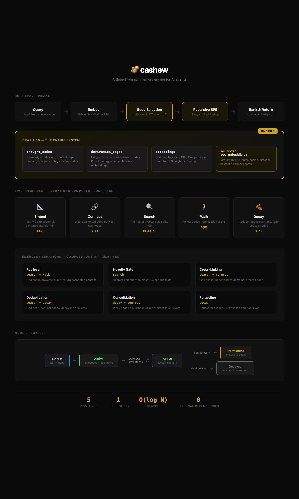

# Cashew 🥜

**Persistent thought-graph memory for AI agents.**

The name comes from asking "do cats eat cashews?" — a question I asked my aunt as a 10-year-old kid in India, because the cashews were left open in the kitchen and I knew stray cats sneak into homes to eat food. My family still brings it up every time I visit. I never stopped asking questions. This system doesn't either — autonomous think cycles find connections you didn't know existed.

📝 **Blog post:** [I Built My AI a Brain and It Started Thinking for Itself](https://open.substack.com/pub/rajkripaldanday/p/i-built-my-ai-a-brain-and-it-started)

## Architecture



## What It Does

- **Remembers across sessions.** Decisions, patterns, relationships, and project context survive compaction and restart. Your agent picks up where it left off.
- **Learns autonomously.** Think cycles find cross-domain connections without prompting. A pattern in your work habits connects to a pattern in your communication style — the brain surfaces it.
- **Stays fast at scale.** sqlite-vec for O(log N) retrieval, recursive BFS graph walk, constant context cost regardless of graph size. 3,000 nodes costs the same as 300.

## What If Forgetting Is the Intelligence?

Cashew doesn't hoard everything. Organic decay means low-value knowledge fades naturally while important patterns strengthen through use. No manual curation needed — the graph self-organizes through cross-linking and natural selection. See [PHILOSOPHY.md](PHILOSOPHY.md) for the full manifesto.

## Quick Start

```bash
pip install cashew-brain
cashew init
cashew context --hints "test"
```

That's it. Your brain is empty but ready. Start extracting knowledge:

```bash
echo "I prefer TypeScript over JavaScript for complex projects" | cashew extract --input -
```

Query it back:

```bash
cashew context --hints "programming language preferences"
```

## Integration

### Claude Code

Copy the skill into your personal skills directory:

```bash
# From the cashew repo
cp -r skills/claude-code/ ~/.claude/skills/cashew/
```

This gives you the `/cashew` slash command and automatic context loading. Claude Code will query your brain before answering substantive questions and extract knowledge during conversations.

Or if you cloned the repo, just open it in Claude Code — the `.claude/skills/cashew/` directory auto-discovers.

### OpenClaw

Install as an OpenClaw skill for full automation — cron jobs handle extraction, think cycles, and dashboard deployment without manual intervention. See `skills/openclaw/SKILL.md` for setup instructions.

### Ingest Sources

Cashew ships with built-in extractors for common knowledge sources. Each one handles checkpointing, incremental updates, and deduplication automatically.

**Obsidian vault:**

```bash
cashew ingest obsidian /path/to/vault
```

Parses YAML frontmatter (tags, aliases, dates), follows `[[wikilinks]]` to create edges between related notes, respects `.obsidianignore`, and auto-detects domains from your folder structure. Your second brain becomes your AI's brain.

**OpenClaw session logs:**

```bash
cashew ingest sessions /path/to/sessions/
```

Extracts knowledge from conversation history. Tracks how far into each session file it's read, so growing sessions get incrementally processed. Filters out tool calls and system messages.

**Markdown directory:**

```bash
cashew ingest markdown /path/to/notes/
```

General purpose extractor for any directory of `.md` files. Respects `.cashewignore` for excluding files.

**Options:**

```bash
cashew ingest --list          # Show available extractors
cashew ingest obsidian /path --no-llm  # Skip LLM, use paragraph splitting fallback
```

All extractors use LLM-based extraction by default for richer, typed knowledge (decisions, insights, facts). Use `--no-llm` for offline or token-free ingestion.

### Python API

```python
from core.context import ContextRetriever
from core.embeddings import load_embeddings

# Query context
embeddings = load_embeddings("path/to/graph.db")
retriever = ContextRetriever("path/to/graph.db", embeddings)
context = retriever.generate_context(hints=["work", "projects"])
```

## Architecture

- **Single SQLite file.** No external servers, no separate indexes. Your entire brain is one portable file.
- **Local embeddings.** all-MiniLM-L6-v2 (384 dims). Downloads ~500MB on first run, then runs locally forever. No API calls for retrieval.
- **LLM for intelligence.** Extraction and think cycles need an LLM (Claude, GPT, etc). Retrieval and storage don't. Bring your own via `model_fn` parameter or API key.
- **Retrieval.** sqlite-vec seeds (O(log N) nearest neighbor) → recursive BFS graph walk (seeds=5, picks_per_hop=3, max_depth=3). The graph's organic connectivity provides implicit hierarchy — no synthetic summary nodes needed.
- **Organic decay.** Nodes that aren't accessed lose fitness over time. Low-fitness nodes get marked decayed and excluded from retrieval. The graph forgets what doesn't matter.

## CLI Reference

| Command | Purpose |
|---------|---------|
| `cashew init` | Initialize a new brain |
| `cashew context --hints "..."` | Retrieve relevant context |
| `cashew extract --input file.md` | Extract knowledge from text |
| `cashew ingest obsidian /path` | Ingest an Obsidian vault |
| `cashew ingest sessions /path` | Ingest OpenClaw session logs |
| `cashew ingest markdown /path` | Ingest a directory of markdown files |
| `cashew think` | Run a think cycle |
| `cashew sleep` | Full sleep cycle (consolidation) |
| `cashew stats` | Graph statistics |

## Requirements

- Python 3.10+
- ~2GB RAM (for embedding model)
- ~500MB disk (embedding model, downloaded on first use)
- An LLM API key for extraction and think cycles (optional for retrieval-only use)

## Philosophy

Cashew ships with a philosophy document that defines how a brain-equipped agent should operate. It covers brain sovereignty, evidence over defaults, the sponge principle, cross-domain vision, and why divergence between instances is the whole point.

Read it: [PHILOSOPHY.md](PHILOSOPHY.md)

## Development

```bash
git clone https://github.com/rajkripal/cashew.git
cd cashew
pip install -e ".[dev]"
pytest
```

See [CLAUDE.md](CLAUDE.md) for the developer guide — architecture, schema, conventions, and engineering philosophy.

## License

MIT — see [LICENSE](LICENSE).

---

Built by [rajkripal](https://github.com/rajkripal).
